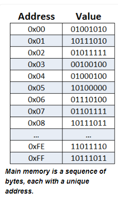
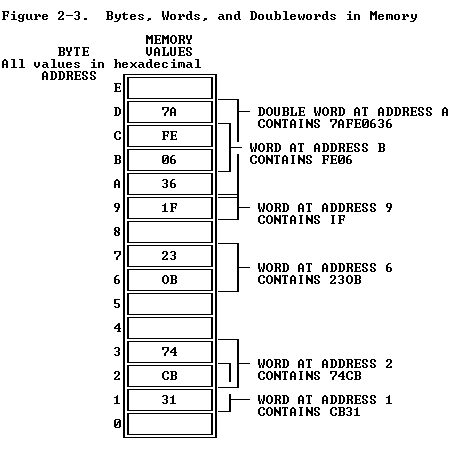
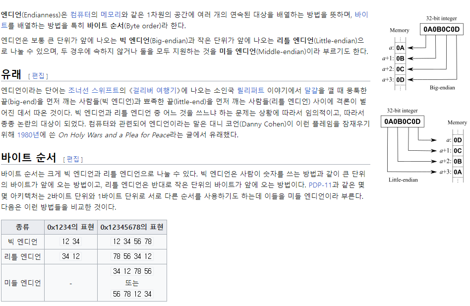
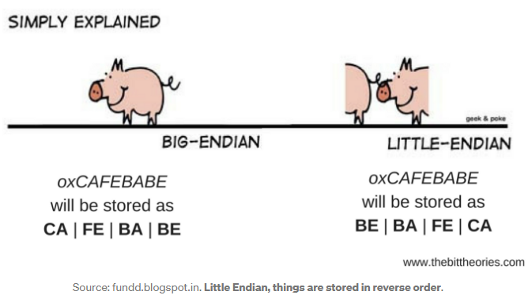
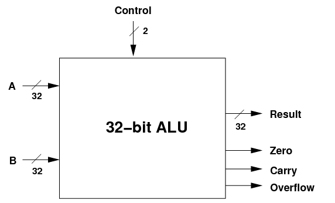
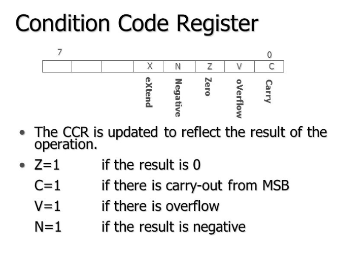
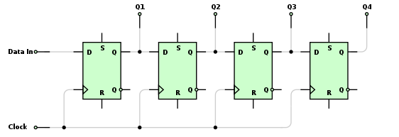
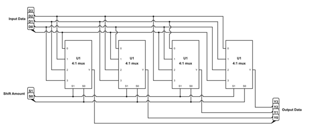

# 컴퓨터 내부 구조
- 컴퓨터 하드웨어는 어떻게 구성되는가?


이전에 배운 내용들

- 비트의 특성과 이 특성을 활용하는 방법
- 비트를 사용하는 이유와 이를 하드웨어로 구현하는 방법
- 기본적인 전자 부품과 이를 조합하는 여러 가지 방법

이렇게 배운 전자 부품으로 만든 회로 ----> 컴퓨터

컴퓨터는 다양한 방법으로 만들 수 있다.

여기 나온 방법은 설명을 위해 선택한 방법


## 현대적 컴퓨터

- 메모리 (기억장치)
- 입력과 출력
- CPU (중앙 처리 장치)

위 세 가지 부분이 서로 어떻게 연관 되는지 보자


## 메모리

컴퓨터에는 조작할 비트들을 저장할 장소가 필요하다.

이런 장소를 메모리라고 부르며 이를 3장에서 배웠다.

이제는 컴퓨터가 메모리를 어떻게 사용하는지 살펴보자.


### 메모리 길

메모리는 집이 빈틉없이 늘어선 거리와 같다.

모든 집은 크기가 똑같고 모든 집에는 정해진 개수만큼 비트를 저장할 수 있는 방이 있다.

컴퓨터를 만드는 규칙에는 각 집마다 1바이트를 저장한다고 되어 있다.

실제 거리와 마찬가지로 각 집에는 주소가 부여된다.



[메모리_기본_이미지](https://computerscience.chemeketa.edu/cs160Reader/ComputerArchitecture/Memory.html)


### 바이트 처리

메모리의 기본 단위가 바이트라고 바이트 단위로만 데이터를 읽을 필요는 없다.

32비트 컴퓨터는 메모리를 4바이트, 64비트 컴퓨터는 8바이트로 구성해서 빠르게 데이터를 처리한다.

(긴워드? 더블워드?)

이 경우에는 4 바이트에 해당하는 주소가 필요하다.




[주소_이미지](https://www.scs.stanford.edu/05au-cs240c/lab/i386/s02_02.htm)


### 워드, 더블워드 메모리의 구조

또 다른 관점으로,

32비트 컴퓨터의 메모리 구조를 포플렉스(fourplex)가 늘어서 있는 길로 생각할 수도 있다.

각 포플렉스에는 다시 듀플렉스가 2개 들어있고, 각 듀플렉스에는 유닛이 2개 들어 있다.

(= 유닛, 듀플렉스, 포플렉스의 주소를 지정할 수 있다는 뜻)


[그림](없음)


### 메모리에서 데이터 읽는 방법

각 건물과 고속도로가 연결될 때 바이트마다 각기 다른 차선을 배정받고, 긴 워드는 고속도로 전체를 사용한다.

도심을 오가는 비트들은 좌석이 4개인 버스를 사용해 오가며, 버스 좌석은 차선마다 하나씩이다.

이 버스는 오직 한 건물에만 정차해 비트를 태워서 도심으로 돌아온다. 즉, 두 건물을 들릴 수 없다.

이 경우에는 두 번 왕복해서 처리한다.

이런식으로 데이터를 읽는 경우를 정렬이 맞지 않는 접근이라고 한다. (non aligned access)


당연한 말이지만, 

다양한 메모리가 있고, 서로 가성비가 다르다.

빠르면 비싸고 싸면 느리다.


### 엔디안

데이터를 왼쪽부터 읽을것인가 오른쪽부터 읽을것인가?

프로세서에 따라 방식이 다르다.


- 인텔: 리틀엔디안
- amd: 리틀엔디안
- 맥: 리틀엔디안
- 모토로라: 빅엔디안





한 시스템에서 다른 시스템으로 데이터를 전송할때는 엔디안을 염두에 둬야 한다.


## 입력과 출력

컴퓨터에 연결하는 장치

먼 옛날에는 I/O 버스가 따로 존재했으나 지금은 메모리 버스와 공유해서 쓴다.


## CPU

(그림에서 도심에 해당)

실제 계산을 처리하는 컴퓨터 부품


### 산술 논리 장치(ALU, arithmetic logic unit)

산술 계산, 불리언 대수 및 기타 연산을 수행하는 방법을 알고 있는 장치



- 피연산자: 수를 표현하는 비트
- 연산 코드(명령 코드): 어떤 연산자를 적용할지 지정
- 결과: 피연산자에 연산자를 적용한 결과
- 조건 코드: 결과에 대한 추가 정보

#### 조건 코드 레지스터(=상태 레지스터)

산술 연산 결과의 상태를 알려주는 플래그 비트들이 모인 레지스터



프로세서마다 다름


### 시프트

ALU 명령중 시프트가 있다.

왼쪽 시프트는 2 곱할때 편하고 오른쪽 시프트는 2로 나누는것과 같다.

각 시프트 연산시 버려지는 MSB, LSB는 상태 레지스터에 저장한다.


### 시프트 제외

시프트 제외 ALU 기능은 조합 논리로 구현 가능하다.

클록에 따라 1비트씩 시프트하는 시프트 레지스터를 플립플롭을 사용해 만들 수 있다.



한 클록마다 시프트하기 때문에 느리다.

멀티플렉서를 조합한 barrel shifter를 쓰면 비트당 하나씩 시프트거 가능하다.




```
이렇게 게이트 부품을 사용한 다이어그램을 보여주는 이유는

게이트, 먹스, 디먹스, 가산기, 래치 등의 기능은 모두 IC 디자인 시스템에서 사용할 수 있는 기성 부품으로 존재하기 때문.

단일 칩 안에 여러 기성 부품을 조립할 수 있다.
```


### 실행 장치(= 제어 장치)

메모리의 정해진 장소에서 명령 코드와 피연산자들을 가져와서 ALU에게 어떤 연산을 수행할지 알려주고, 결과를 메모리에 돌려준다.

실행 장치는 우리가 제공한 처리방법에 대한 명령어 목록을 메모리에 저장하면 이를 읽어서 처리한다.

이런 방식으로 실행되는 컴퓨터를 프로그램 저장 방식 컴퓨터라고 부른다. (앨런 튜닝의 아이디어)


#### 명령어?

컴퓨터에게 어떤 일을 할지 알려주는 비트 패턴으로, CPU마다 다르다

intel, arm이 다른 이유이다.


#### 프로그램 카운터

메모리에서 명령어를 가져와야 하는 위치는 프로그램 카운터에 들어있는 메모리 주소를 사용한다.

[책그림보기]

명령어를 수행한 이후에는 주소가 1 증가, 다음 명령어를 가르킨다.

CPU 마다 정해진 초기 프로그램 카운터 값이 있으며, CPU 전원이 들어오면 PC는 이 값으로 설정된다.


## 명령어 집합

메모리에서 찾은건 명령어였다.

이 명령어는 어떻게 구성되어 있는가?

16비트 크기의 명령어를 사용하는 컴퓨터를 가정해보자.


이렇게 나눈다면 결과와 피연산자 주소에 4비트밖에 쓸 수 없기 때문에 좋지 않다.

사용할 수 있는 주소가 16개 뿐이면 쓸모있는 크기의 메모리를 가리킬 수 없기 때문


### DRAM 주소 지정 기법

주소 확장 레지스터를 두고 별도의 명령어를 사용해 상위 주소를 지정.

인텔에서 32비트 CPU를 사용해 4GiB 이상의 메모리에 접근할 때 사용했던 방식이다.

인텔은 이를 PAE(물리 주소 확장)라고 불렀다.

주소 확장 레지스터에 값을 설정하려면 시간이 더 들고, 

메모리 영역을 모두 지정하려면 여러 번 레지스터를 설정해야 한다는 단점이 있다.


### 3주소 명령어가 잘 작동하지 않는 이유

[그림 4-14]에서 세 메모리 블록은 각기 다른 장치에 존재하며 주소 버스와 데이터 버스가 3개씩 따로 존재한다.

연산 결과를 다른 연산에 활용하려면 결과가 들어 있는 메모리 장치에 있는 데이터를 다른 피연산자 메모리 장치로 보내기 위한

별도의 명령어를 사용해야 한다.


이를 활용해서 명령을 수행하는 회로를 만들면 아주 복잡해진다.

그래서 누산기 레지스터를 사용해서 ALU가 계산한 결과를 저장한 뒤 누산기에 있는 값에 대한 연산을 수행함으로써 사이클을 줄일 수 있다.


### 주소 지정 모드

누산기를 쓰면 이전보다 더 나아졌지만 여전히 사용 가능한 주소가 충분하지 않다.

주소를 가리키는 경우를 직접 주소 지정이라고 부른다. 사용할 주소가 명령어에 직접 들어가 있는 것이다.

간접 주소 지정 방식을 쓰면 더 많은 메모리를 사용할 수 있다.


#### 간접 주소 지정 방식

CPU는 명령어에 들어 있는 값을 피연산자 주소로 해석하지 않고 피연산자 주소를 얻을 수 있는 메모리 위치를 가리키는 주소로 사용한다.


이외에도 즉시 주소 지정 모드가 있는데 상수를 누산기에 저장할때 사용한다.


> 메모리를 더 많이 참조하는 만큼 속도가 느리다.


### 조건 코드 명령어

산술 연산을 제외한 상태 레지스터의 값을 주산기로 복사하는 명령어와 누산기의 값을 조건 코드 레지스터에 복사하는 명령어도 있다.

### 분기 명령어

명령어는 순서대로 수행된다.

그 와중에 분기처리를 하고 싶을때가 있으면 좋겠다고 생각할 것이다.

그래서 분기 명령어가 존재한다.

조건에 따라서 분기가 가능하다.

[표4-2]


### 최종 명령어 집합 구성

모든 기능이 포함된 그림은 [4-17]과 같다.

모드와 명령 코드를 사용해서 원하는 작업을 수행하는 프로그램을 작성할 수 있게 되었다.


## 마지막 설계

모든 요소를 합쳐서 실제 컴퓨터로 만든다.


### 명령어 레지스터

피보나치 프로그램을 한 번에 한 명령어씩 실행한다고 생각할 수 있지만 컴퓨터 내부에서는 더 많은 일이 일어난다.

[그림4ㅡ20] 에 나와있는것 처럼 두 단계로 이뤄진 상태 기계로 설명이 가능하다.

fetch를 통해 명령어를 가져오고, 이를 실행한다.

CPU에 있는 명령어 레지스터에 실행중인 명령어를 저장한다.


### 데이터 경로와 제어 신호

모든 기능을 구현하기 위해 아래 그림과 같이 각 레지스터가 연결되었다.


> 모든 레지스터에 전달되는 시스템 클록이 생략됨


### 데이터 흐름 제어

각 장치를 사용하기 위한 처리 방식은 고정되어있다.

> 이 예제의 RAM은 클록이 생략되어 있음을 유의


#### fetch에는 다음과 같은 신호가 필요하다.

1. address source는 프로그램 카운터를 선택
2. 메모리 동작 (enable=1). r/w는 읽기(1)로 설정
3. 명령어 레지스터 동작(enable=1)

#### 간접적으로 주소를 메모리에서 가져오기 위한 신호

1. address source 명령어 레지스터로 지정
2. 메모리 동작 (enable=1). r/w(read=1)
3. 간접 주소 레지스터 동작(enable=1)

이런 방식으로 여러 단계를 거쳐 원하는 동작을 수행한다.


## RISC, CISC 명령어 집합

컴퓨터 제어 회로가 상당히 복잡한데 반해, 사용하지 않는 복잡한 명령어가 많아서 이런 명령어들을 단순한 명령어를

조합해서 처리한 RISC가 나옴

기존 설계 방식은 CISC라고 한다.


### RISC 특징

적재 - 저장 구조(load-store architecture)를 사용한다.

메모리와 레지스터를 오가는 명령어들과 레지스터 간 명령어로만 이뤄진 구조이다.

시간이 지나며 RISC는 CISC보다 더 복잡해졌다.


## GPU

그래픽 처리에 특화된 장치

특징짓는 기능으로 두 가지가 있다.

1. 간단한 처리 장치가 아주 많이 들어 있다.
2. CPU보다 메모리 버스의 폭이 더 넓다.

2번 덕분에 메모리에 더 빠르게 접근할 수 있다.

시간이 지나면서 GPU 활용 분야가 더 커졌다.