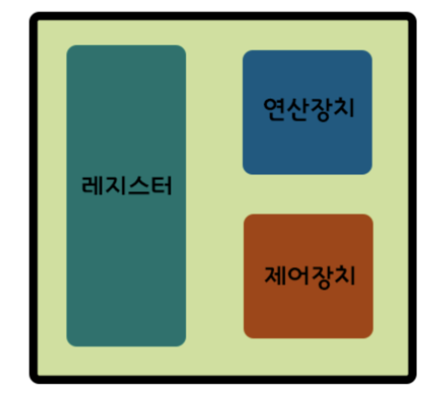
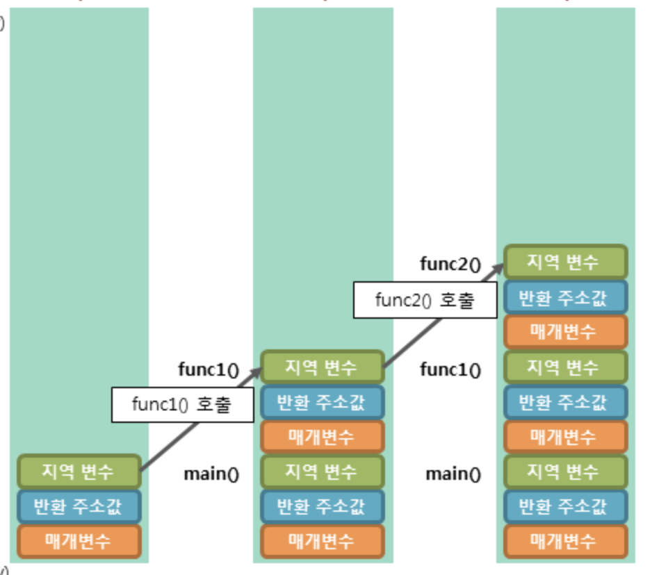
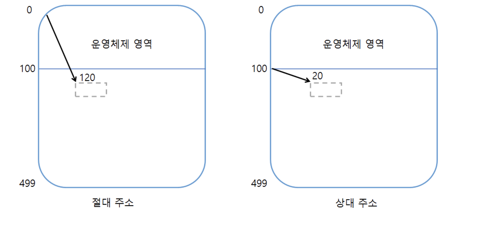
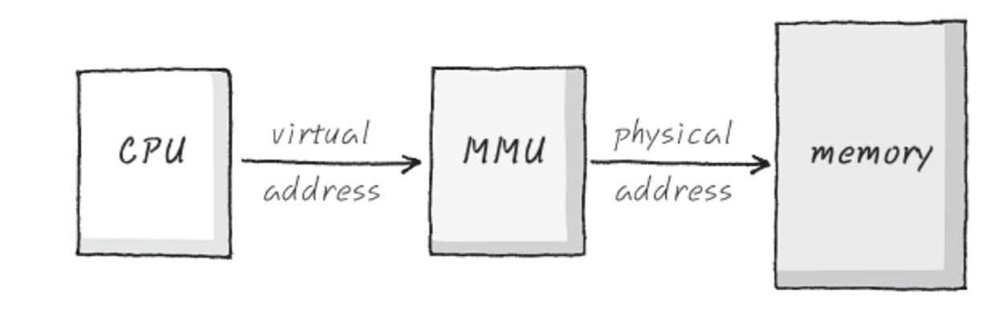

## CPU 기본적인 구성 요소들

가장 흔한 두 가지 컴퓨터 구조는 폰 노이만 구조와 하버드 구조다.
폰노이만 구조는 CPU, 메모리, 프로그램 구조를 갖는 범용 컴퓨터 구조를 확립했다.

- 장점 - 컴퓨터에 다른 작업을 시키려 할 때 하드웨어(전선)을 재배치할 필요 없이 소프트웨어만 교체하면 되기 때문에 범용성이 크게 향상 됨. 이후의 모든 컴퓨터 구조는 이 구조에서 나왔다고 보면 된다.
- 단점 - 데이터 메모리와 명령어 메모리가 구분되어 있지 않고 하나의 버스를 갖고 있는 구조 때문에 CPU가 명령어와 데이터를 동시에 가져올 수 없어서 속도가 조금 느리다.

<하버드구조>

- 폰노이만 구조에서 CPU가 명령어와 데이터에 동시 접근이 불가능한 부분을 개선하여 명령용 버스와 데이터용 버스를 물리적으로 분할한 구조. 명령을 메모리로부터 읽는 것과 데이터를 메모리로 부터 읽는 것을 동시에 할 수 있음. => 더 빠른 속도를 낸다.
- 단점은 이러한 처리속도를 위해 많은 전기 회로가 필요하고, 두개의 버스와 메모리를 가지게 되므로 CPU코어에서 공간을 많이 차지하게 됨.

---

## 멀티 코어의 등장

전력장벽이란, CPU의 성능을 올리기 위해서 더 많은 전력을 공급하자니CPU가 냉각이 안되고, 
전압을 낮춰서 전류를 많이 흘려보내자니 너무 전압이 낮아져서 전류가 새어버리는 현상이 발생해 기존 반도체 공정으로는 프로세서의 성능을 더 이상 향상시키지 못하는 결과가 초래한 것을 말한다. 
때문에 싱글코어 시스템에서는 더 이상 성능을 향상시킬 수 없게 되었다.

전력장벽은 컴퓨터 CPU의 설계와 발전방향성을 완전히 뒤바꿔 놓았다. CPU가 싱글코어가 아닌 멀티코어방식으로 등장하게 된 것.

멀티코어 : CPU가 여러개의 코어로 구성되어 있는 것. 주변 처리장치나 공통 기본 메모리는 공유함. 프로그램 동시처리에 도움이 됨.

CPU : 산술연산장치, 레지스터, 실행장치를 가짐 (=프로세서 )
코어 : 각 명령어 수행을 위한 산술연산장치, 실행장치를 갖는 것으로, cpu의 핵심 요소.

---

## 마이크로프로세서와 마이크로컴퓨터

### <마이크로프로세서>

- 내부에 레지스터, 제어장치, 산술연산장치를 포함하여 연산에 특화된 기능을 갖는 장치
- 개별적으로는 연산만 가능할 뿐 저장장치(램,롬), 입출력장치 등의 주변 장치가 있어야 사용할 수 있다.

### <마이크로컴퓨터>

- 마이크로컨트롤러 라고도 불리며, 마이크로프로세서와 이를 사용하기 위한 메모리, 입출력장치 등이 함께 들어있는 장치.

---

## 함수

갑자기 함수의 등장. 아마도 이제 컴퓨터에 다른 작업을 시키려 할 때 하드웨어(전선)을 재배치할 필요 없이 소프트웨어만 교체하면 되기 때문에 함수가 등장한 것 같다.(?)

함수가 잘 동작하려면, 함수를 호출하는 부분에서 함수를 실행하고 다시 원래 자리로 돌아올 방법이 필요하다.
원래 자리로 돌아오기 위해서는 어디서 함수로 들어갔는지를 기억해야 한다. 이 (함수로 들어간)위치는 바로 프로그램 카운터의 값이다. (다음에 실행할 명령어의 주소가 PC에 저장되니까)

함수 호출 흐름

1.  100 번지: 프로그램 시작
2.  101 번지: 함수에서 돌아올 주소 (105번지) 설정
3.  102 번지: 101번지에서 설정한 주소 값을 200번지에 저장
4.  103 번지: 함수 파라미터 값 전달
5.  104 번지: function 호출 (분기)
6.  200 번지: 함수 산출값을 저장되어 있던 주소로 반환 (간접 분기)
7.  105 번지: 함수 산출값 받기

---

## 스택

함수가 다른 함수를 호출하거나 재귀를 하는 경우 처음에 저장해둔 반환 위치가 사라지기 때문에 최초 함수를 호출했던 자리로 돌아갈 수 없게 된다.

1.  100 번지: 프로그램 시작
2.  101 번지: 함수에서 돌아올 주소 (105번지) 설정 => 요기쯤에서 함수 호출 자리가 덮어씌워짐(?)
3.  102 번지: 101번지에서 설정한 주소 값을 200번지에 저장
4.  103 번지: 함수 파라미터 값 전달
5.  104 번지: function cube 호출 (분기)
6.  200 번지: 함수 산출값을 저장되어 있던 주소로 반환 (간접 분기)
7.  105 번지: 함수 산출값 받기

때문에 이런 경우 반환 주소를 여럿 저장할 수 있어야 함. 그리고 함수에서 호출 지점으로 반환할 때
저장된 주소 중 어떤 주소를 사용할지 결정할 수 있어야 한다.
이걸 위해 스택을 사용한다.
스택은 단지 반환 주소만 저장하는게 아니다. 함수에서 사용되는 지역변수도 저장한다.
이렇게 하면 함수 호출이 서로 독립적이게 됨.
함수가 호출될 때마다 스택에 저장되는 데이터 모음을 스택 프레임 이라고 부른다.

이런느낌

---

## 인터럽트 (=시스템의 초인종)

1. CPU가 주의를 기울여야 하는 주변장치는 인터럽트 요청을 생성한다.
2. 프로세서는 현재 실행중인 명령어를 끝까지 실행한다.
3. 프로세서는 현재 실행중인 프로그램을 잠시 중단시키고 인터럽트 핸들러라는 프로그램을 실행한다.
4. 인터럽트 핸들러가 작업을 마치면 원래 실행중이던 프로그램이 중단된 위치부터 다시 실행을 계속한다.

인터럽트 핸들러는 인터럽트 처리를 정해진 시간 안에 끝내야 하고,
인터럽트를 서비스 한 뒤에 원래대로 돌아오기 위해 현재 상태를 저장한다. (스택에 저장)
인터럽트가 많이 있는 기계에는 종종 인터럽트 간의 우선순위가 있어, 더 중요한걸 먼저 처리하게 해준다.
또는 인터럽트를 중단시킬 수 있는 마스크(Mask)가 있는 경우도 있다.

---

## 상대 주소 지정

여러 프로그램을 동시에 실행할 때 OS는 사용자 프로그램의 실행 시간을 조절하는 시분할 방식을 사용한다.
시분할 방식은, 정해진 시간 간격 동안 여러 사용자 프로그램을 메모리에 넣어 실행한다.
상대 주소 지정을 사용하면, 절대 주소 지정과 다르게 프로그램을 메모리의 원하는 위치로 자유롭게 재배치 할 수 있다.
절대 주소 지정은 명령어 주소 부분에 있는 값이 실제 데이터가 있는 주기억 장치 내의 주소를 가리킨다.
상대주소는 메모리 공간에서 사용자 영역이 시작되는 주소 번지를 0번지로 변경하여 사용하는 주소 지정 방식이다.
즉, 사용자 프로세스 입장에서 메모리 공간을 바라본 주소는 절대주소와 상과없이 항상 0번지부터 시작한다.

- 상대 주소 사용의 중요성
  사용자 입장에서 절대 주소를 사용하게 되면 불편하고 위험하기 때문이다.

절대 주소를 사용하게 되면 사용자 프로세스 입장에서는 운영체제 영역은 사용할 수 없는 공간이지만 매번 운영체제 영역을 확인해야 하는 불편함이 존재하고 사실 상 절대 주소를 사용자 프로세스가 알 필요는 없다.

하지만 상대 주소를 사용하면 상대 주소가 운영체제 영역의 위치를 알 필요가 없고 주소가 항상 0번지부터 시작하기 때문에 편리해진다.

또한, 절대 주소를 사용하게 되면 사용자가 운영체제 영역의 주소를 실수나 고의적인 조작으로 접근할 수 있는 위험의 소지가 있게 된다.

---

## 메모리 관리 장치 (MMU)

멀티태스킹을 할 때, 사용자 프로그램에 버그가 있어서 사용자 프로그램2가 사용자 프로그램1이 차지한 메모리를 덮어쓴다면, 심지어 OS의 메모리를 덮어쓴다면 큰일일 것이다.
이런 시나리오가 불가능하도록 각 프로그램을 분리하기 위해 메모리 관리 장치가 생겼다.

MMU는 CPU에게서 받은 가상 주소를 물리 주소로 바꿔서 매핑해주는 역할을 한다.
이 때 필요한 것

1. 가상주소와 물리주소를 연결해주는 테이블이 있어야 함 => 이것을 Page Table이라고 한다.
2. 이 테이블이 존재하는 위치를 알아야 함. => TTB (Translation Table Base Address)라고 함. MMU의 레지스터 중 하나에 저장되어 있음.

---

### MMU가 하는 일

1. CPU는 Memory의 어딘가를 접근하기 위해서 가상주소 발생
2. MMU는 이 가상주소를 받아서 Memory의 TTB에서부터 시작해서 존재하는 Page Table에 접근
3. 찾아간 Page Table안에 물리 주소를 찾아내어 주소 신호를 발생하고,
4. Memory는 해당 물리 주소 안에 Data를 출력해서 CPU에게 전달.
5. Data가 CPU에 전달 됨.

- 그러나 메모리를 일일이 가상 주소에서 물리적 주소로 번역하게 되면 작업 부하가 너무 높아지므로, MMU는 RAM을 여러 부분(페이지, pages)로 나누어 각 페이지를 하나의 독립된 항목으로 처리함.
- 페이지 및 주소 번역 정보를 기억하는 작업이 가상 메모리를 구현하는 데 있어 결정적인 절차임.

---

## 가상 메모리..

프로그램의 크기가 커지고 복잡해짐에 따라 메모리에 프로그램을 올릴 수 없는 현상이 나타났다.
이에 따라 가상 메모리를 활용하게 되었다. (OS가 MMU를 사용해 사용자 프로그램에게 가상 메모리를 제공한다.)

#### 가상메모리란

- 메모리가 실제 메모리보다 많아 보이게 하는 기술로, 어떤 프로세스가 실행될 때 메모리에 해당 프로세스 전체가 올라가지 않더라도 실행이 가능하다는 점에 착안하여 고안 됨.
- 어플리케이션이 실행될 때, 실행에 필요한 일부분만 메모리에 올라가며 애플리케이션의 나머지는 디스크에 남게 됨. 즉, 디스크가 RAM의 보조 기억장치처럼 작동하는 것임.
  - 결국 빠르고 작은 기억장치(RAM)을 크고 느린 기억장치(디스크)와 병합하여, 하나의 크고 빠른 기억장치(가상 메모리)처럼 동작하게 하는 것임.
  - 요구불 페이징(스왑 아웃/스왑인 동작) => RAM활용 + DISK활용

#### 요구 페이징 (요구불 페이징)

- CPU가 요청할 때 프로세스의 데이터를 메모리에 올리는 것을 의미. 즉, 처음부터 모든 데이터를 메모리로 적재하진 않음.

#### 페이지 폴트

- 페이지 폴트란, 어떤 프로그램이 자신의 주소 공간(가상 메모리 공간)에는 존재하지만 시스템의 RAM에는 현재 존재하지 않는 데이터·코드에 접근을 시도할 경우 발생하는 현상을 의미함.
- 페이지 폴트가 발생하면 운영체제는 그 데이터를 메모리로 가져와서, 마치 페이지 폴트가 전혀 발생하지 않은 것처럼 프로그램이 계속적으로 작동하게 해줌.

---

### 캐시 메모리..

캐시 메모리란, 속도가 빠른 장치와 느린 장치 사이에서 속도 차에 따른 병목 현상을 줄이기 위한 범용 메모리를 의미한다.
CPU가 빨라짐에 따라 메모리 속도가 이를 따라오지 못해서 CPU가 메모리 처리를 기다리느라 아무 일도 하지 않는 경우를 줄이기 위해 CPU에 추가 된 작고 빠른 메모리다.
하지만 이런 캐시도 CPU에서 물리적으로 멀어질 수록 더 느려지고 더 커진다.
이들을 L1, L2, L3캐시라고 부른다. (L은 Level의 약자.)

캐시 메모리는 CPU가 메모리를 읽는 과정에서 자주 이용하는 정보를 캐시 메모리에 저장함으로써 재사용 시 나타날 정보의 거리를 줄여준다.
L1에 찾고자 하는 내용이 없다면 순서대로 2,3에서 데이터를 찾는다.

---

## 사용자모드와 시스템모드

우리가 흔히 사용하는 운영체제는 여러 프로그램이 동시에 실행될 수 있는 다중 프로그래밍 환경에서 동작한다.
그러므로 각 프로그램들이 다른 프로그램의 실행을 방해하거나 프로그램 간에 서로 충돌을 일으키는 문제를 막기 위해 하드웨어에 대한 각종 보안 기법이 필요하다.

하드웨어 적인 보안을 유지하기 위해 운영체제는 기본적으로 두가지 모드를 제공하는데 시스템모드(kernel mode, system mode), 사용자 모드(user mode)가 이에 해당.

시스템 모드는 운영체제가 CPU의 제어권을 가지고 운영 체제 코드를 실행하는 모드로서, 이 모드에서는 모든 종류의 명령을 다 실행할 수 있다.
반면에 사용자 모드에서는 일반 사용자 프로그램이 실행되며 제한적인 명령만을 수행할 수 있다.
시스템에 중요한 영향을 미치는 연산은 시스템 모드에서만 실행 가능하도록 함으로써 하드웨어의 보안을 유지하는 것.

프로세스는 두 모드중 하나의 모드만을 가지는 것이 아니라 실행되는 동안 수없이 유저모드와 시스템모드를 반복하면서 실행된다.

시스템 모드와 사용자 모드를 구분하기 위해 하드웨어 적으로 CPU 내부에 모드 비트(mode bit)를 사용한다. 
모드 비트가 0으로 세팅되어 있으면 시스템 모드로서 모든 명령을 수행할 수 있고, 모드 비트가 1로 세팅되어 있으면 사용자 모드로서 제한된 명령만을 수행할 수 있다.

예를 들어 프로세스가 사용자 모드에서 작업을 수행하다 하드웨어 접근 등 보안에 필요한 중요한 명령을 수행해야 할 경우에는 시스템 콜(소프트웨어 인터럽트)을 통해 운영체제에게 서비스를 대신해 줄 것을 요청하게 된다. 그러면 CPU의 제어권은 다시 운영체제로 넘어가게 된다. 인터럽트가 발생할 때에는 모드 비트가 자동적으로 0으로 세팅되어 필요한 작업을 수행하고 요청된 작업이 끝나게 되면 모드 비트는 다시 1로 만들어 사용자 프로그램에게 CPU를 넘겨주게 됨.

---

## 요약

1. 폰노이만 CPU구조로 인해 컴퓨터에 다른 작업을 시키려 할 때 소프트웨어만 교체하면 되기 때문에 범용성이 크게 향상 됨
2. 함수 사용 => 스택을 통해 함수의 주소, 지역변수 등을 저장하여 함수가 정상 작동하도록 고안함
3. 전력장벽으로 인해 멀티코어 CPU가 등장. => 이후 CPU의 속도가 계속해서 발전함
4. 멀티 코어로 인해 다양한 일을 동시에 진행하는게 가능해짐. => 멀티태스킹
5. 멀티태스킹을 통한 프로그램 간의 메모리 침범 등의 부작용을 막기 위해 인터럽트, MMU 등을 활용하게 됨
6. 멀티 태스킹이 가능해지고 CPU의 성능이 좋아지면서 프로그램 또한 크고 복잡해짐
7. 크고 복잡해진 프로그램을 실행하기 위해서 기존의 메모리만으로는 용량이 부족해진다. => 가상메모리 활용
8. CPU의 성능을 메모리가 따라오지 못하게 되자 느린 메모리 처리 속도를 보충하기 위해 캐시메모리 등장 => 속도 개선
9. 사용자 프로그램과 시스템 프로그램이 각자 자기가 맡은 일을 하게 됨. (멀티태스킹)
10. 시스템 프로그램이 컴퓨터의 중요한 일들을 도맡아 함으로써 사용자 프로그램으로부터 컴퓨터를 보호함.

---

<더 참고하면 좋은 자료>

- 주소지정방식 : https://blog.naver.com/PostView.nhn?isHttpsRedirect=true&blogId=ljh0326s&logNo=220833949031
- MMU : http://recipes.egloos.com/5232056
