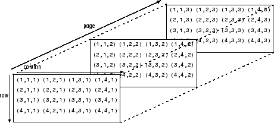
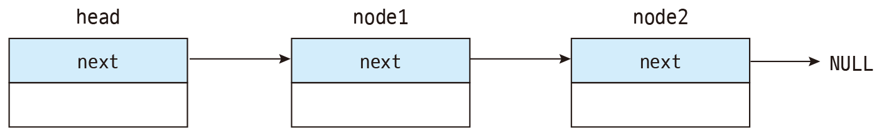
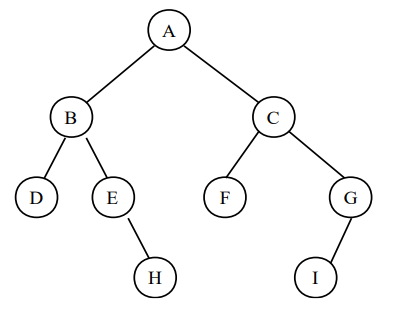

# Chapter 7. 데이터 구조와 처리 
### 어떻게 해야 프로그램에서 데이터를 잘 구성하고 처리할까?
* 컴퓨터에서 자료구조(data structure, 데이터 구조)를 어떻게 활용하느냐에 따라 데이터를 처리하는 성능이 달라진다.
* 자료구조에 따라 `공간/시간 트레이드 오프`가 따르기도 한다. 
  
   

> 참조 지역성이 핵심!  
> *'필요한 데이터를 (메모리에서) 서로 근처에 유지하라. 금방 사용할 데이터라면 더 가까운 곳에 저장하라'*

 

### 기본 데이터 타입
* 프로그래밍 언어에는 기본 데이터 타입(primitive type)이 존재
* 데이터 타입별로 메모리에서 차지하는 크기와 표현하는 정보가 다르다
  * 부호를 가지는 정수, 부동소수점, 문자, 논리 자료형 등
* C언어에는 포인터(pointer)라는 기본 데이터 타입이 존재
  * 메모리 주소를 나타내는 부호가 없는 정수를 저장
  * 일부 언어에서는, 잘못된 포인터 사용으로 인한 오류를 막기 위해, 참조(reference)라는 추상화된 개념을 구현

 

### 배열
* 원소들이 연속적인 형태로 구성된 구조를 가진 자료구조. 배열에서 원소의 위치는 인덱스를 통해 나타낸다.
* 원소의 위치를 배열의 첫 번째 원소의 주소인 기저 주소로부터 떨어진 정도를 나타내는 상대 주소로 표현할 수 있다.

 

* 배열의 형태는 순차적인 1차원 배열부터, 배열의 각 원소가 다시 배열로 이루어지는 다차원 배열까지 다양하게 구성할 수 있다.
* 다차원 배열을 순회할 때, 참조 지역성을 고려하여 순회하도록 설계하는 것이 좋다. 
  * 행 인덱스가 바뀌는 것 보다 열 인덱스가 바뀔 때 더 많은 이동이 일어난다.

 

### 문자열
* 여러 문자로 이뤄진 시퀀스(순차 구조) 형태를 가진 자료형
* 배열과 유사한 성격을 가진 자료형
* 가변 문자열의 길이를 추적하는 방법
  * 문자열의 길이에 대한 정보를 메모리에 저장
  * C 언어에서는 문자열에 대한 데이터 타입 없이, byte 배열을 이용. 길이를 저장하지 않고 문자열 데이터 끝에 
  문자열 터미네이터를 사용하여 문자열의 종료를 나타냄. 
  
   

  

 

### 단일 연결 리스트
* 배열은 데이터의 길이가 정해져 있을 때는 효과적이지만, 가변적인 경우에는 성능이 저하된다. 새로운 데이터가 추가될 때 새로운 배열을 만들고, 기존 배열의
  데이터를 복사하는 과정이 필요하다.
* 순차적인 구조를 유지하면서, 데이터의 추가 및 삭제에도 성능을 유지할 수 있는 자료구조가 연결 리스트(linked list)이다.

 

* 배열과 리스트의 가장 큰 차이점은 배열은 참조 지역성에 영향을 받지만, 리스트는 영향을 받지 않는다는 점이다. 
  * 리스트의 원소는 메모리의 어디에 위치하여도 상관없다. 포인터가 메모리 주소를 참조하고 있기만 하면 된다.
* 원소를 추가하거나 제거할 때는, 앞뒤 원소의 포인터가 바라보는 주소를 바꾸는 방식으로 진행한다.

 

### 이중 연결 리스트

* 단일 연결 리스트는 원소를 삭제할 때, 원소 추가에 비해 성능이 저하된다. 
  * 삭제하려는 원소의 바로 앞 원소를 찾아 포인터를 변경해 주어야 하기 때문이다.
  * 최악의 경우에는 긴 리스트를 순회해야 한다.
* 이중 연결 리스트(doubly linked list)는 노드에 다음 원소에 대한 포인터뿐만 아니라 이전 원소에 대한 포인터도 들어 있는
  리스트
  * 단일 연결 리스트에 비해, 시공간 트레이드 오프를 통해, 메모리를 더 사용하여 연산 시간을 줄인 자료구조이다.

 

### 계층적인 데이터 구조
* 지금까지 배열과 리스트 등, 선형적인 형태의 자료구조를 살펴봤다. 선형성은 데이터를 조회할 때 문제가 된다.
  * 길이가 n인 배열 혹은 리스트의 저장된 데이터를 찾기 위해서는 최대 n번 노드를 순회하며 원하는 노드인지 확인해야 한다.
* 노드에 들어가는 포인터를 활용해서 계층적인 형태의 자료구조를 만들 수 있다. 

 

* 가장 간단한 계층적 데이터 구조는 최대 2개의 다른 노드와 연결될 수 있는 2진 트리(binary tree)이다.
* 2진 트리는 노드의 삽입 순서에 따라서 형태가 달라질 수 있다.   
  * 최악의 경우 편향된 트리의 형태를 띄어서, 계층적 구조의 이점을 전혀 가질 수 없는 경우도 있다.
* 2진 트리에서 어떤 대상을 검색하는 함수는 계층의 높이에 의해 정의된다.
  * 트리가 n계층만큼 아래로 내려간다면 n번 원소를 비교해서 검색할 수 있다.
  * 균형 잡힌 트리에서는 `log2`번에 검색이 가능
  * 2진 트리의 균형을 회복하는 데에는 시공간 트레이드 오프가 따르지만, 부가 비용을 빠르게 극복할 수 있을만큼의 
  검색 효율을 제공한다.

 

### 복합 데이터 타입
* C언어에서는 사용자가 원하는 형태로 기본 데이터 타입을 조합하여 새로운 형태의 사용자 정의 타입을 만들 수 있다.
  * 이를 구조체(struct)라고 하며, 구조체를 구성하는 데이터들을 멤버(member) 혹은 멤버 변수(member variable)라고 한다.
* 객체지향 프로그래밍 언어에서는 구조체의 개념이 클래스로 확장되어 사용된다.

 

### 데이터베이스
* 대용량 데이터를 저장하기 적합한 자료구조.
* 데이터베이스 관리 시스템(DBMS, database management system)을 통해서 데이터를 저장하고 관리.
* B-트리를 활용한 인덱스 자료구조를 통해서 데이터 탐색 성능을 높임  
