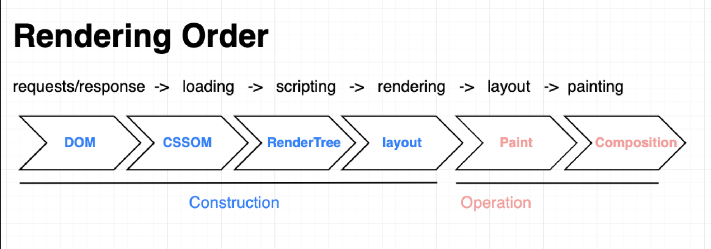

## 웹 브라우저란?

웹 브라우저는 웹서버에와 쌍방향으로 통신하고, 웹서버가 반환한 웹페이지를 표시하는 GUI기반의 응용 소프트웨어이다. 또한 웹 브라우저는 소프트웨어로만 구현한 추상적인 컴퓨터이며 인터프리터에 속한다.

## 브라우저가 작동할 때 사용되는 재료들

### 1. 마크업 언어

- markup은 본문과 구분할 수 있는 마크를 추가할 수 있는 시스템이다. 일부 문자에 특별한 힘을 부여하여 해당 문자를 만나면 '이렇게 보여줘'하고 명령할 수 있다.

#### 마크업 언어의 종류

1. SGML
   - Standard Generalized Markup Language
   - 마크업 언어를 생성하기 위한 메타 마크업 언어로, 다른 마크업 언어를 기술할 때의 규격이 된다.
   - HTML과 달리 마크업을 사용자가 정의할 수 있다.
   - HTML의 조상격 언어이지만, HTML5부터는 SGML을 준수하려는 노력을 하지 않기로 결정했다고 한다.
   - XHTML은 HTML을 변형한 형태의 언어인데, XML 규칙을 준수하도록 만들어졌다.
2. HTML
   - 하이퍼 링크 시스템을 가지고 있는 언어로, 웹 페이지에서 다른 페이지로 이동할 수 있도록 만든 언어.
   - 웹 문서를 제작하기 위한 언어로써 등장.
   - 약속한 태그들만 사용 가능. (ex : `<p></p>`, `<footer></footer>` 등..)
   - 데이터를 표현하는 데 포커스를 맞춘 언어.
3. XML (eXtensible Markup Language)
   - 데이터를 전달하는 데 포커스를 맞춘 언어.
   - tag가 미리 정의되어 있지 않아서 사용자가 임의로 만든 태그로 사용 가능하다. (ex : `<garden></garden>`) 그래서 extensible이라는 단어가 붙음.
   - 왜 확장 가능한 마크업 언어가 등장했나?
     - 태그로 데이터를 설명하기 위해.
     - HTML의 한계를 극복하기 위해 등장. (HTML은 문서의 표현 방식에 치중할 뿐 문서의 구조를 표현하기 어렵다. )
   - 때문에 정보를 주고받을 땐 XML이 유용하다. 사용 방법은 아래와 같음. (근데 이젠 json 쓰면 되긴 함)

```html
<!DOCTYPE html>
<html>
  <body>
    <p id="demo"></p>

    <script>
      var parser, xmlDoc;
      var text =
        '<bookstore><book>' +
        '<title>Everyday Italian</title>' +
        '<author>Giada De Laurentiis</author>' +
        '<year>2005</year>' +
        '</book></bookstore>';

      parser = new DOMParser();
      xmlDoc = parser.parseFromString(text, 'text/xml');

      document.getElementById('demo').innerHTML = xmlDoc.getElementsByTagName('title')[0].childNodes[0].nodeValue;
    </script>
  </body>
</html>
```

4. XHTML
   - HTML을 XML로 재 구축한 마크업 언어로, HTML의 단점을 보완하여 폭 넓게 사용할 수 있음.
   - XHTML은 HTML과 비교했을 때 element, attribute에 차이가 없다. 하지만 더 엄격한 규칙을 적용하기 때문에 몇 가지 차이점이 있다. (종료 태그 생략 불가 등..)
   - 왜 등장했나?
     - 기존 HTML은 다소 부정확한 코딩이 있어도 무시하고 처리한다. 그런데 이게 다양한 에이전트가 생겨나면서 (다양한 웹,모바일 기기) 동일한 output을 내지 못하게 됨.
     - 이런 단점을 보완하기 위해 더 엄격한 문법인 XHTML이 등장함.
   - HTML5가 나오면서 기존 HTML의 단점이 보완되었기 때문에 XHTML을 자세히 보지 않을 것임.

### 2. URL

- 서버에 자원을 요청할 때 사용하는 주소.
- 스키마/호스트/경로:port 구조로 되어있다. `https://www.example.com:80` <--이렇게
- 스키마 자리에는 리소스를 가져올 때 어떤 규칙을 사용해서 서버와 대화할 지를 정해 그에 맞는 스키마를 작성한다.
- 호스트 자리에는 등록된 도메인 이름이나 IP주소를 작성한다.
- 경로 자리에는 접근할 대상의 경로에 대한 상세한 정보를 작성한다.
- port 자리에는 서버와 만나기 위한 약속 장소를 정한다고 생각하면 된다. 여러 개의 골목 길이 있을 때 80번 골목에서 만나자! 하고 약속하는 것과 비슷하다. http는 80번포트를 디폴트로 사용하기 때문에 포트번호는 보통 생략한다. (https는 443포트)

### 3. DOM

- DOM은 HTML을 브라우저가 이해하고 사용할 수 있는 자신들만의 객체로 변환한 것이다.
- html파일에서 쓰인 태그가 js에서는 node로 바뀐다. (js로 html에 접근할 때 node에 접근함)
- html은 메모리에 보관할 수 있는 오브젝트로 변환되는데 이것이 DOM tree.
- 브라우저가 DOM을 만들면 CSS를 병합하여 CSSOM을 만든다.
- CSSOM을 읽어 최종적인 스타일을 계산한 뒤 사용자에게 보여질 요소를 보여주는 Render Tree가 완성된다.

---

💡 브라우저에서 URL을 입력하면 일어나는 일 (DOM을 갖다가 브라우저가 지지고 볶는 과정)



- Construction : html페이지에서 브라우저가 이해할 수 있도록 브라우저만의 언어로 바꾸는 파트
- Operation : 이렇게 만들어진 rendering tree를 이용해서 구조를 작성하고 어디에 배치할 건지 계산하고, 실제로 브라우저 위에 그림을 그리는 파트.

- requests/response : 먼저 브라우저가 서버에게 html 파일을 요청한다.
- loading : html파일을 서버에게 받아 로딩을 하고,
- scripting : html코드를 한 줄 한 줄 읽어서 DOM 요소로 변환한다.
- rendering : DOM을 브라우저 위에 표기하기 위해 준비하는데, rendering tree를 만든 다음,
- layout : 각각의 요소가 어느 위치에 얼만큼의 크기로 표기될 건지 계산하고
- painting : 그림을 그린다.

  - 계산한 것들을 바로 그리는 것이 아니라, 이 요소들을 어떻게 배치했느냐에 따라서
  - paint부분에서는 각각 부분을 조금씩 잘게 잘게 나누어, 이미지를 준비해 놓는다.
  - 그리고 이 요소들을 속성값에 따라 레이어로 만든다. (포토샵 레이어 생각하면 됨)
  - 이렇게 각각 레이어로 만들어 두어야 한 요소의 수정이 필요할 때
  - 전체를 수정할 필요 없이 해당 레이어만 수정하면 되기 때문.
  - 레이어가 너무 많이 생겨도 성능이 떨어지기 때문에 남용하지 말아야 함.
  - composition : 이렇게 준비된 레이어들을 순서대로 차곡차곡 배치한다.

- UI가 변경될 때 composition만 일어나는게 좋다. layout또는 paint부터 다시 되어야 하는 경우 성능이 떨어진다. (ex: top, left.. 등으로 요소를 움직이면 layout이 발생하는데 translate를 사용해서 요소를 움직일 경우 composition만 일어나므로 성능이 더 좋다.)

---

### 4. JSON

- 자바스크립트 오브젝트와 동일한 형태를 string으로 저장하고있는 가벼운 데이터 포맷.
- js object로 변환하여 사용할 수 있고, 자바스크립트만이 아닌 다른 언어에서도 호환이 된다.
- 데이터 계층을 표현하기 용이하고 사람이 읽고 작성하기 쉬움 + 기계가 parsing하기에도 좋다는 점 때문에 xml보다 더 많이 쓰이게 되었다.
