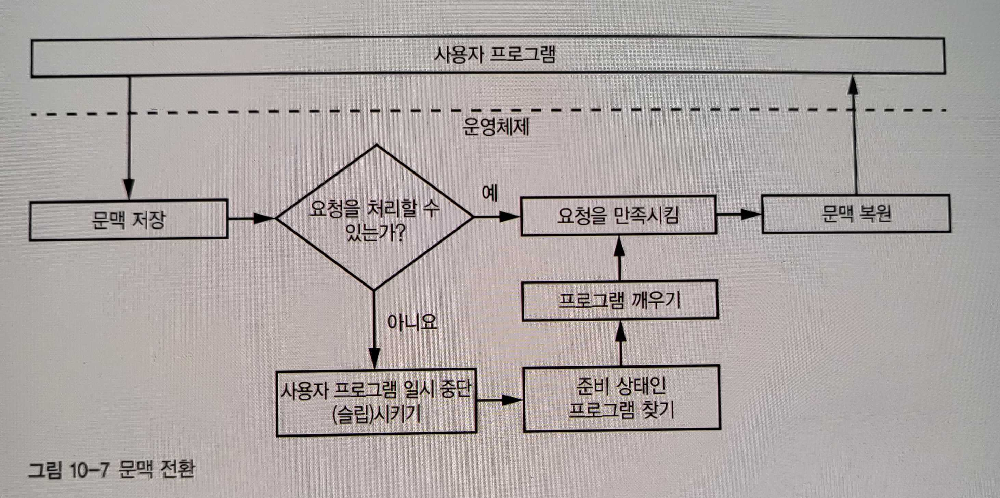
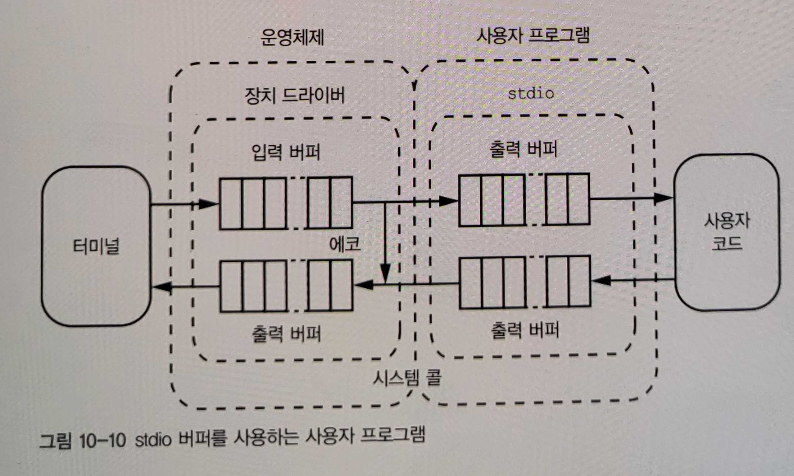
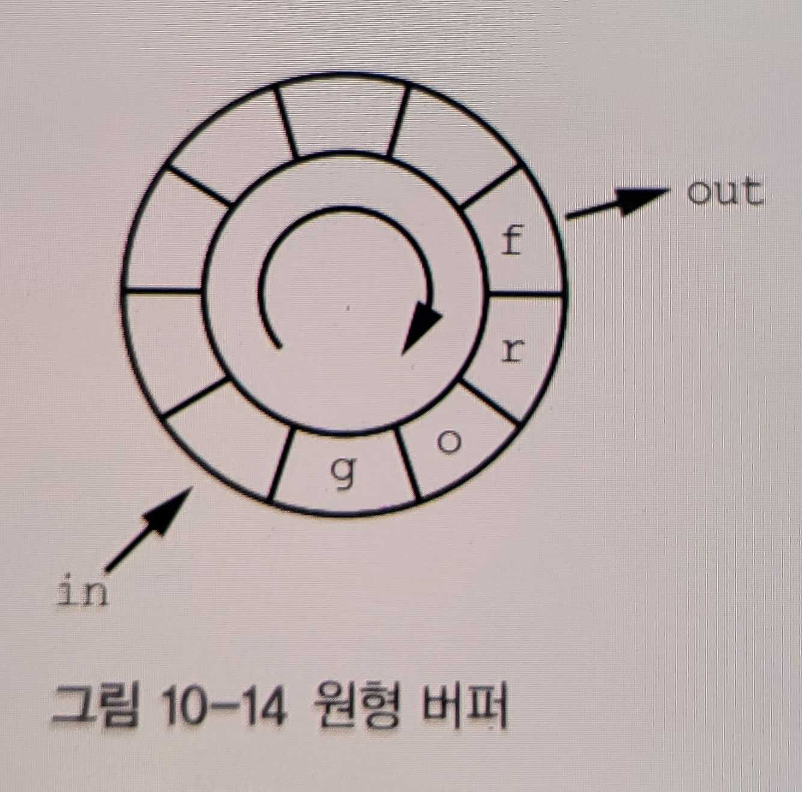

10장. 애플리케이션 프로그램과 시스템 프로그래밍
======

> **고수준 언어와 저수준 언어 프로그래밍 방식 비교**

<br/>


**웹 브라우저**는 고차원의 명령어를 제공하는 컴퓨터를 구현한다고 9장에서 배웠다.

비슷한 프로그램을 **웹 브라우저**를 실행하는 프로그램과 사용하지 않는 프로그램을 작성 하는 방식은 어떻게 다를까


<br/>
<br/>
<br/>

---

<br/>
<br/>
<br/>

***웹 애플리케이션***은 브라우저가 지원하는 HTML, CSS, JAVASCRIPT만 알면 누구나 쉽게 만들 수 있다.
코드가 어떤 식으로 윈도우 창에 내용물을 그리며 사용자의 입력을 어떻게 받고 어떻게 처리하는지 몰라도 된다. 이렇게 고수준 애플리케이션만 만든다면 시스템 프로그래밍에 대해서 알 필요는 없다.

> 브라우저가 사라지면 어떻게 하죠

<br/>
<br/>
<br/>

컴퓨터와 사용자가 상호작용을 하는 프로그램을 Javascript와 C로 작성한다고 해보자.


<br/>
<br/>
<br/>

---

<br/>
<br/>
<br/>

## HTML, CSS, Javascript

```html
<!-- HTML -->
<html>
  <head>
    <title>컴퓨터랑 사용자가 상호작용 하는 페이지</title>
    <style>
      /* 페이지를 예쁘게 */
    </style>
    <script>
      // 페이지를 동적으로
      const yesButton = document.getElementById('yes')
      const noButton = document.getElementById('no')
      const ayaInput = document.getElementById('aya')

      yesButton.addEventListener('click', () => {
        const aya = ayaInput.value
        if (aya !== '') {
          if (aya === '눈') alert('루테인을 드세요')
          else if (aya === '머리') alert('타이레놀을 드세요')
          else alert('병원을 가세요')
        }
      })

      noButton.addEventListener('click', () => {
        alert('왜 오셨나요?')
      })
    </script>
  </head>
  <body>
    <!-- 질문이 보여질 곳 -->
    <div id="dialog">
      <div>어디가 아프신가요?</div>
    </div>

    <!-- 사용자의 입력 -->
    <div id="yesno">
      <input id="aya" type="text" />
      <button id="yes">여기요</button>
      <button id="no">안아픈데요</button>
    </div>
  </body>
</html>
```

웹 페이지를 구성하는 요소를 알면 쉽게 사용자와 상호작용을 하는 프로그램을 만들 수 있다.

사용자 입력을 어떻게 받을건지 잘 몰라도 브라우저가 지원하는 요소를 쓰면 쉽게 입력을 받고

내용을 화면에 출력을 할 수 있다.

<br/>
<br/>
<br/>

---

<br/>
<br/>
<br/>

## C언어

위에서 만든 화면과 동일한 것을 만드는건 어렵게 때문에 예제는 터미널로 퉁친다.

<br/>
<br/>
<br/>

### 빌드

gcc를 사용해서 소스 코드를 컴파일 해준다.

<br/>
<br/>
<br/>

### 터미널과 장치 드라이버


터미널은 사용자 프로그램과 직접 통신하지 않고 운영체제를 통한다.

<br/>
<br/>
<br/>

### 문맥 전환



사용자 프로그램은 하나 이상 실행할 수 있다.

그러나 컴퓨터는 레지스터 집합이 하나뿐이어서 프로그램을 실행할 때마다 복잡한 처리가 필요하다.

<br/>
<br/>
<br/>

### 표준 I/O



입출력을 효율적으로 하기 위해서 **표준 입/출력 라이브러리인 stdio**가 만들어졌다.

<br/>
<br/>
<br/>

### 원형 버퍼



버퍼의 공간을 효율적으로 관리하기 위해서 원형 버퍼가 쓰인다.

<br/>
<br/>
<br/>

### 실제 C코드

```c
#include <stdio.h> // 표준 입출력
#include <stdlib.h> // 메모리의 동적 할당
#include <string.h> // 문자열 처리

struct node {
  struct node *no;
  struct node *yes;
  char string[1];
}


// 메모리 할당
struct node *make_node(char *string)
{
  struct node *memory;

  if ((memory = (struct node *)malloc(sizeof (struct node) + strlen(string))) == (struct node *)0) {
    (void)fprintf(stderr, "gta: out of memory.\n");
    exit(-1);
  }

  (void)strcpy(memory->string, string);
  memory->yes = memory->no = (struct node *)0;

  return (memory);
}

// 엔트리
int main(int argc, char *argv[])
{
  char animal[50];
  char buffer[3];
  int c;
  struct node **current;
  FILE *in;
  struct node *new;
  FILE *out;
  char *p;
  char q[100];
  struct node *root;

  in = out = (FILE *)0;

  // 코드 생략
}
```

**코드가 길기 때문에 주요코드 생략**

<br/>
<br/>
<br/>

코드를 보면 입력 받을 버퍼의 사이즈를 얼마나 할당 할 것인지 부터 파일 시스템에 접근해서 파일을 어떻게 읽고 쓸 것인지, 

그냥 보기 싫어졌다.

저수준의 경우 본인의 실력에 따라 뭐든 만들 수 있지만 HTML, CSS, Javascript로 만든 애플리케이션은 브라우저가 제공하는 기능만 붙일 수 있다.