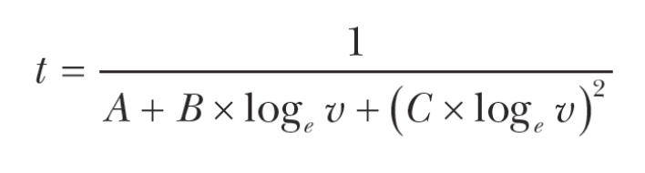
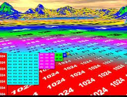
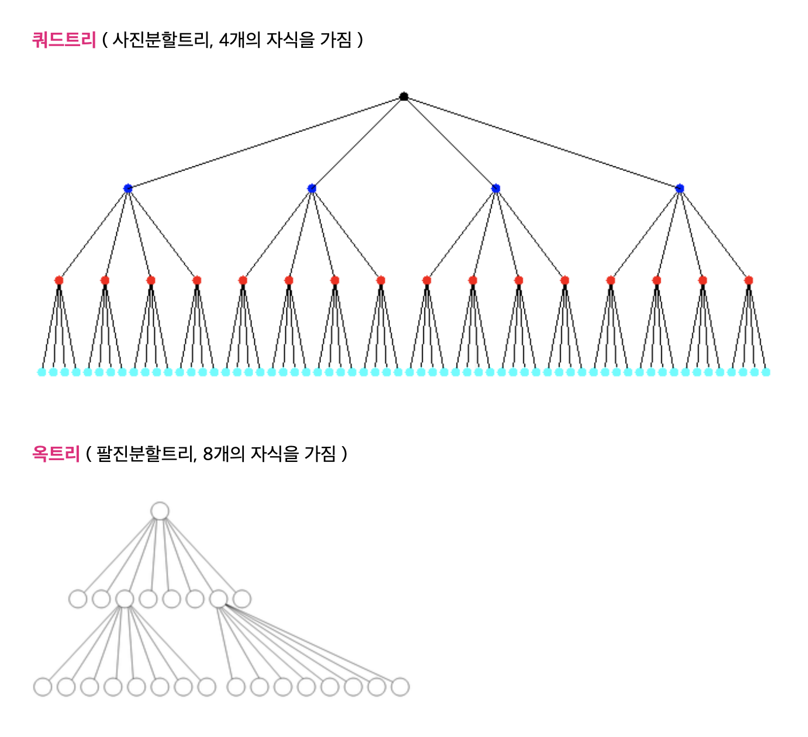

# 성능 향상을 위한 알고리즘 기법 (계산 간소화)

## 표 찾기

계산을 많이 하는 경우, 그 결과를 미리 계산해서 값을 반복 사용할때 사용함

### 변환

- 변환을 위한 계산을 없애려면 변환된 값을 가지고 있는 표가 있으면 된다

매번 비싸고 어려운 계산을 하는 것 보다

표에 해당하는 위치에 있는 값을 가져오는것이 합리적

### 텍스처 매핑

- 게임이나 영화 등 이미지를 만들때도 표 찾기 기법이 중요한 역할을 함

**MIP 매핑**  
  
픽셀(8비트)을 32비트 시스템에서 정사각형 나열을 할 경우 1/4 낭비 
-> 이미지의 1/4 크기 복사본을 낭비하던 공간에 넣는 방식

  

사용자의 시점에 따라 텍스처 이미지를 계산하는게 아니라 
MIP맵의 계층에 있는 이미지를 가져와 사용함

자주 사용할 정보를 미리 계산해 두는 것은 루프 불변값 최적화와 비슷

### 문자 종류 판별

각 판별 if 문을 사용하는 것 보다 표를 사용한 루틴을 이용했더니 
-> 간단한 코드와 20배 더 빠른 속도 
(아스키 코드 표를 작성하는 세가지 문자 종류 판별 코드의 방법)

---

## 정수를 사용한 계산 방법

- 정수 덧셈, 뺄셈
- 곱셈, 나눗셈
- 부동소수점 연산
- 삼각함수, 로그(대수)함수 계산

순서대로 하드웨어에서 연산속도, 전력소모 측면에서 비용이 많이 든다

현대적 컴퓨터 그래픽 시스템들은 임의로 좌표계 변환을 지원함 
(x, y) 좌표를 변환(transformation) 적용 -> 화면 좌표 (x', y')로 변환(affine)

ex) 2차원 변환(affine) = 3x3 정사각 행렬로 표현 가능

### 직선, 곡선

직선의 점 마다 부동소수점 계산을 하는 것은 매우 느리다 (현대적 컴퓨터는 최적화기가 개선을 해줌)

x 가 변할 때 마다 y 를 계산하기 때문에 매번 더하기만 하면 곱샘을 없앨수가 있다! 
=> 정수만 사용하는 버전으로 바꿀수 있음 (js는 내부적으로 정수를 쓰는지 제어하지 못함)

### 다항식

상수로부터 차례로 더하면서 변화를 누적시킬 수 있는 n가지 차이로 이루어진 집합을 만드는 것 
-> 독립 변수가 하나뿐 이기 떄문에 잘 작동한다

---

## 재귀적 분할

### 나선

js 등에서 제공하는 수학 라이브러리에 있는 삼각함수는 도가 아니라 라디안(radian, π) 단위로 각도를 입력 받음

중심에서 멀어질수록 더 많은 점을 계산할 방법이 필요 
= 두 점이 충분히 가깝지 않다면 각도 차이를 반으로 줄여 재시도 (재귀적 수행)

### 구성적인 기하

**2 차원** 
쿼드트리에 불리언 함수 적용시 간단한 기하학적 요소로 부터 복잡한 모양을 만들 수 있음

**3 차원** 
구조적 입체 기하(3차원) : 3차원에서는 2차원보다 노드가 2배 더 필요함, 쿼드트리를 옥트리로 확장

복셀(부피가 있는 픽셀) : 2차원 픽셀에 대응하는 3차원 요소

**쿼드트리는 평면에 적합, 옥트리는 공간에 적합하다**

- 쿼드트리는 높이 면에 대한 분할을 하지않는다
- 옥트리는 높이에 대한 분할까지 시도함

#### 옥트리는 왜 노드를 많이 분할해야 할까?

각 노드를 세분화 할수록 좀 더 디테일하게 오브젝트들의 렌더링 여부를 판단할 수 있으며,  각 노드들의 위치에 따라서 렌더링할 오브젝트의 세밀함 정도도 판단할 수 있다
