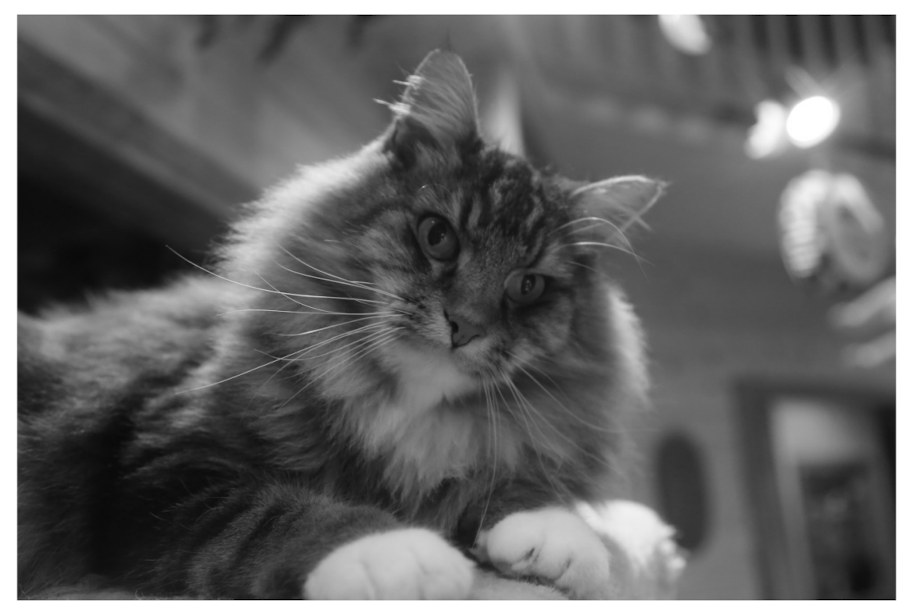
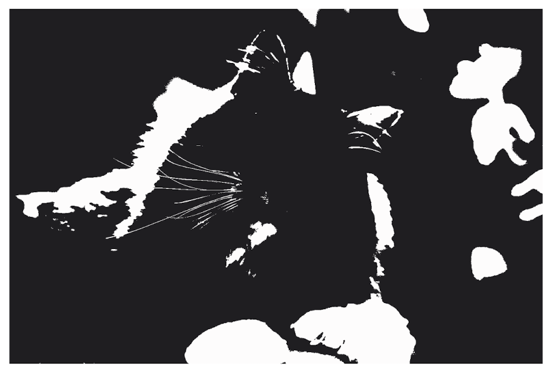

## 시프트와 마스크

1. Shift

   - 비트 연산자 중 하나로 비트 값을 왼쪽 혹은 오른쪽으로 이동시키는 연산자입니다.

   ```
   x = 5
   x << 2   : 20
   x >> 3   : 0
   x >>> 4  : 0
   ```

   왼쪽으로는 2의 배수의 곱이고, 오른쪽으로는 2의 배수의 나눗셈입니다.

2. Mask
   - 비트 마스크는 말 그대로 비트를 마스킹 하는 테크닉인데요. 비트 연산을 활용해서 정수의 이진 비트를 처리하는 작업입니다. 정수 하나만 이용해서 배열을 사용하는것과 같은거죠.

이걸 활용해서 문자를 바꾸는 작업 같아요

## 멱급수 근삿값 계산 (Power series)

- 급수 : 수열의 합
- 멱수열 : 등차수열과 등비수열이 마구마구 합쳐져 있음
- 멱급수 : 멱수열의 합(거듭제곱 급수)

패스

# 무작위성과 관련 있는 예제들

컴퓨터에서 완전한 난수를 계산하기는 아주 어렵다. 난수를 만들려면 어떤 공식을 기반으로 생성해야 하는데, 정해진 공식으로 생성한 난수는 반복적일 수 밖에 없다.
하지만 크립토그래피를 제외한 대부분의 계산 작업에는 이런 유형의 난수로 충분하다.

## 공간을 채우는 곡선


그림에서 알 수 있듯이, 이 곡선은 여러 방향으로 줄어들고 반복될 수 있는 간단한 모양입니다. 반복이 계속되면 더 많은 공간을 채운다고 해요.

공간을 채우는 곡선은 자기 유사성을 보여줍니다. 자기 유사성이란 멀리서 보나 가까이 다가가서 보나 곡선이 비슷해 보인다는 뜻이다. 이런 곡선은 프랙탈이라는 집합의 부분집합입니다. 프랙탈이라는 용어는 프랙션(분수)라는 말에서 나왔습니다. 예를 들어 정사각형의 각 변을 2배 늘리면 넓이는 4배가 되지만 프랙탈에서는 길이를 정수 배 늘리면 넓이가 분수 배 늘어난다.


## L시스템

L-system(엘 시스템, Lindenmayer system)은 형식문법의 일종으로서, 식물의 성장 프로세스를 기초로 한 다양한 자연물의 구조를 기술하거나 표현을 가능케 하는 알고리즘이다. 자연물 이외에도 이른바 자기상사 도형이나 프랙탈 도형을 생성할 경우에도 사용된다.

0 = 죽음, 1 = 성장


## 스토캐스틱

뭔가 복잡하게 들릴 말을 하고 싶은데 랜덤이라는 말로는 충분치 않을 때 쓰는 말이다.
랜덤은 variable에 no bias나 예측이 아예 불가할때 쓰이고, stochastic는 anaysis나 프로세스에 더 많이 쓰임. (주식 차트를 볼 때 많이 사용)
https://velog.io/@eunice123/ch2-%EC%9A%A9%EC%96%B4%EC%A0%95%EB%A6%AC-1-stochastic%EC%9D%B4%EB%9E%80

## 양자화

원래 이미지에 있는 색에 대해 변환될 이미지에서 쓸 수 있는 색을 할당해야 한다는 뜻입니다.
아날로그 데이터, 즉 연속적인 값을 디지털 데이터, 즉 띄엄띄엄한 값으로 바꾸어 근사하는 과정을 뜻합니다.


### 임계화

미리 어떤 한계값을 정하고 그보다 더 밝은 값을 흰색으로, 그보다 더 어두운 값을 검은색으로 지정하는 방식이다. 하지만 그래봐야 나쁜 결과를 얻는다.


### 망점 인쇄


이미지를 여러 크기의 점으로 분해합니다. 오른쪽 이미지를 확대하면 왼쪽 이미지와 같습니다. 컴퓨터 화면에서는 점 크기를 변화시킬 수는 없지만, 같은 효과를 얻고 싶죠. 어떤 점이 흰색이거나 검은색일 수 밖에 없다는 특징을 바꿀 수는 없기에, 주변의 점을 어떻게든 변화시켜서 우리의 눈이 여러 회색조로 판단하게 해야합니다. 기본적으로 이런 일은 해상도를 희생해 색이나 명암을 인식할 수 있게 하는 트레이드 오프입니다. 이런 처리 과정을 **디더링**이라고 부릅니다. 비행기 엔진이 만들어내는 임의의 진동이 기어,바퀴,톱니 등의 컴퓨터 부품이 서로 빡빡하게 물리는 일을 막았던 현상을 보고 비행기에서 컴퓨터가 더 잘 작동한다는 사실을 발견했습니다. 진동하는 모터를 지상에 있는 컴퓨터에 추가해서 컴퓨터를 흔들리게 하자 실제로 컴퓨터가 더 잘 작동하게 되었죠. 이런 임의의 진동을 떤다는 뜻의 중세 영어 **디더런**을 본따서 **디더** 라고 불렀습니다.
