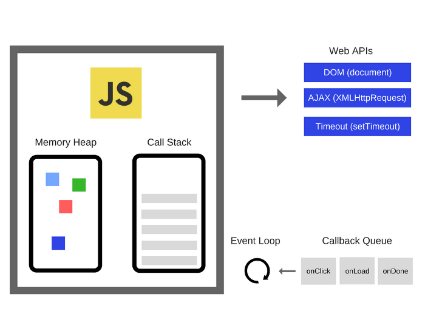

## 병렬성과 비동기성

### 컴퓨터는 어떻게 한 번에 많은 일을 하는가?
* 컴퓨터가 한 번에 둘 이상의 작업을 수행하는 것을 멀티태스킹(multitasking)이라 한다.
* 멀티코어 프로세스를 갖춘 컴퓨터가 보편화되어, 멀티태스킹 환경에서 작업하는 것은 우리에게 익숙하다.
* 이번 장의 내용을 통해 컴퓨터가 동시에 여러 작업을 수행할 때, 어떤 원리를 통해 오류 없이 동작하게 되는지 알아보자.

### 경합 조건과 공유 자원
* 경합 조건(race condition)이란 2개 이상의 프로그램이 같은 자원에 동시에 접근하여, 자원 사용 순서에 따라 결과가 달라지는 경우를 말한다.

* 위의 예시에서 서로 다른 두 프로그램이 은행 계좌에 동시에 입금하려는 상황을 보여주고 있다. 잘못된 결과 예시처럼 경합 조건 상황에서는 실제 잔액에 반영되어야 하는 금액과 다른 금액이 잔고에 기록될 오류 가능성이 존재한다.
* 이처럼 결과가 달라지게 되는 이유는 두 프로그램에서 은행 계좌를 공유 자원(shared resource)으로 사용했기 때문이다.
* 대부분의 자원 형태가 공유 자원이 될 수 있으며, 많은 경우에서 메모리 자원이 공유 문제와 연관된다.

### 프로세스와 스레드
* 운영체제의 주요 기능 중 하나는 컴퓨터에 여러 작업이 동작할 수 있도록 시스템 자원을 관리하는 것이다.
* 프로세스는 운영체제로부터 시스템 자원을 할당받는 작업의 단위를 말하며, 메모리에 프로그램의 인스턴스가 생성되 실행되고 있는 상태이다.
* 스레드는 하나의 프로세스 내에서 실행되는 흐름의 단위로, 스레드를 통해 프로세스의 자원을 공유하여 일련의 과정을 동시에 진행할 수 있다. 프로세스가 할당 받은 자원을 이용하는 실행의 단위라고 설명하기도 한다.
* 위에서 살펴본 경합 조건이 발생하기 위해서는 여러 프로세스가 병렬로 실행되는 것 뿐만 아니라, 서로 자원을 공유하는 조건이 필요하다. 또한 프로세스 간 통신(Inter-Process Communication, IPC)이 가능한 상황이어야 한다.
* 컴퓨터에서 멀티태스킹을 구현하기 위해 프로세스를 활용하는 것보다, 스레드를 활용한 것이 속도가 더 빠르다. 하지만 스레드를 남용할 경우 보안 및 안정성에 문제가 생길 수 있어 신중해야 한다.

### 락
* 멀티태스킹 환경에서 발생할 수 있는 문제점을 해결하기 위해서는 작업을 어떻게 원자적(atomic)으로 만들 수 있을지 고민해야 한다. 
> 원자성이란 더 이상 쪼개질 수 없는 성질을 말한다. 따라서 어떠한 작업이 원자적이라면, 작업이 실행될 때 완전하게 진행되어 종료하거나, 그럴 수 없는 경우 실행을 하지 않는 특성을 가진다.
* 원자적인 작업 처리가 가능하기 위해선, 하나의 스레드가 특정 자원에 접근중인 경우에는 다른 스레드에서 접근할 수 없게 상호 배제 매커니즘이 필요하다. 이러한 매커니즘을 락(Lock)이라고 한다. 단어 뜻 그대로 다른 곳에서 접근하지 못하도록 잠근다는 뜻이다.
#### 트랜잭션과 작업 크기
* 위에서 설명한 원자적 성질을 가지는 작업 단위를 데이터베이스 시스템에서는 트랜잭션(transaction)이라 부른다. 트랜잭션에 속한 각 연산을 묶어서 처리한다.
* 트랜잭션 단위로 락이 동작하기 때문에, 트랜잭션의 크기를 잘 설정해야 한다. 작업의 단위가 너무 커서 락이 걸려 있는 시간이 길어지게 되면 안된다. 동시성이 가지는 이점이 옅어진다.
#### 락 대기
* 어떤 자원에 락이 걸려있으면, 프로그램은 해당 자원이 사용 가능해질 때까지 대기해야 한다. 보통 두 가지 방법을 통해서 자원 사용 가능 여부를 판단한다. 
* 첫 번째로 락을 성공적으로 얻을 때까지 락 획득을 반복 시도하는 스핀(spin, 회전/뺑뺑이)이 있다. 다른 방법으로 락을 관리하는 쪽에 락 획득 요청을 등록하고, 요청이 받아들여질 때 통지(notify)를 받는 방법도 있다.
* 이를 프로세스 관점으로 바라보면 블로킹 모델에서는 락을 요청한 프로그램은 락 획득 시까지 스핀을 하며 다른 작업을 멈추고 대기한다. 논 블로킹 모델의 프로그램은 락을 요청하고 자신의 작업을 진행하다 락 획득 요청이 받아들여 졌을 때 통지를 받게 된다.
#### 교착 상태
* 프로그램이 락을 획득하기 위해서는 어떤 식으로도 기다려야 하는 것을 알 수 있었다. 복잡한 시스템에서는 여러 락을 사용하는 경우가 많은데, 상황에 따라 두 개 이상의 프로그램이 서로 상대방의 리소스에 대한 접근 권한을 같기 위해 무한히 대기하게 되는 상황이 발생한다. 이를 교착 상태(deadlock)라고 한다.
* 교착 상태를 피하거나 해결하기 위해서는 코드를 잘 작성하는 방법 말고는 훌륭한 대책이 거의 없다.

### 브라우저에서는 어떻게 동시성 프로그래밍을 구현할까?
* 브라우저에서 실행되는 자바스크립트 코드는 싱글 스레드 환경에서 동작한다. 자바스크립트가 1995년 처음 등장했을 때는 비동기 통신을 언어 설계에 고려하지 않았기 때문이다. 
* 문서 객체 모델(DOM, Doucment Object Model)이 등장하고, XHR 객체를 통한 AJAX 통신 기법이 발달하면서 비동기 통신 구현이 자바스크립트 실행 환경에서의 중요한 과제가 되었다.
* 싱글 스레드에서는 함수 호출 스택이 하나만 존재하기 때문에 한 번에 하나의 작업만 처리할 수 있다. 따라서 자바스크립트에서는 동시성을 지원하기 위해 이벤트 루프(event loop) 모델을 고안했다.

* 비동기 작업 Web API를 호출 스택에서 호출하게 되면, Web API는 요청된 작업을 수행한다. JS는 논블로킹 방식으로 그 다음 작업들을 수행한다. 
* Web API는 작업을 완료하면 콜백 함수를 콜백 큐에 보낸다. 이벤트 루프는 호출 스택을 확인하여 현재 실행중인 작업이 없을 때 콜백 큐에서 작업을 꺼내 호출 스택에 추가하여 실행한다.
* 자바스크립트에서 제공하는 Promise 객체를 활용하면 콜백 메커니즘을 효과적으로 구성할 수 있다.
